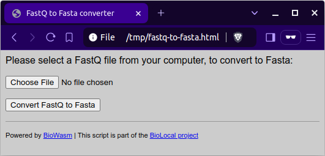

# BioLocal - Run common biological commands locally in the browser

These are a set of scripts leveraging the [biowasm](https://biowasm.com/)
project to create small HTML based tools that allows performing various common
bioinformatics task in the browser without the need to install custom software.

The use case is to be able to run these tools in protected environments where
users might not have the required permissions to install custom software.

An example screenshot of the (so far) only tool included, fastq-to-fasta:

